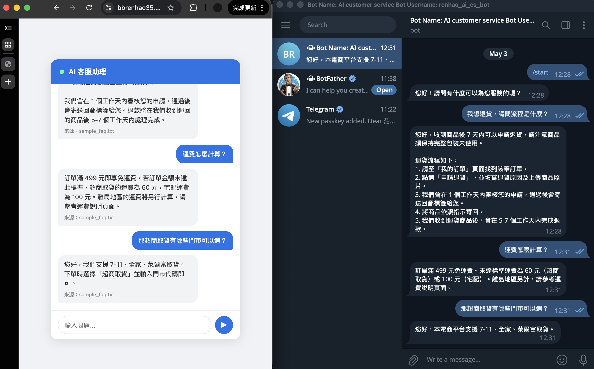

# AI 客服系統

基於 RAG（Retrieval-Augmented Generation）架構的 AI 客服系統。
使用者提問 → 從參考文件找相關資料 → 交給 AI 生成回答。

[](https://github.com/BBRenHao35/ai-customer-service/actions/workflows/deploy.yml)

**Live Demo：** https://BBRenHao35.github.io/ai-customer-service/  
**Telegram Bot：** [@renhao_ai_cs_bot](https://t.me/renhao_ai_cs_bot)

## 畫面截圖

**雙平台：網頁介面 + Telegram Bot，共用同一個後端**



**正常回答：參考文件有的問題**


**多輪對話：連續提問，AI 保留對話脈絡**


**參考文件沒有的問題：AI 誠實告知而非亂編**


## 架構

### 系統架構（使用者端）

```
Browser User              Telegram User
      |                        |
      v                        v  POST /telegram/webhook
+---------------------+   +------------------------------+
|    GitHub Pages     |   |   GCP Cloud Run (FastAPI)    |
|  (Static Frontend)  |-->|                              |
|                     |   |  1. embed()                  |
|                     |   |     -> Gemini Embedding API  |
|                     |   |  2. pgvector search -> Top 5 |
|                     |   |  3. build prompt             |
|                     |   |  4. Gemini Chat API          |
|                     |   |     -> gemini-2.5-flash-lite |
|       Render        |<--|  5. return answer + sources  |
+---------------------+   +---------------+--------------+
                                           |
                                           v
                          +------------------------------+
                          |   Supabase (PostgreSQL)      |
                          |   + pgvector extension       |
                          |   content / source /         |
                          |   embedding (3072 dims)      |
                          +------------------------------+

[Admin API, requires X-Admin-Key header]
POST   /admin/ingest              -> upload doc, chunk, embed, store
GET    /admin/documents           -> list all chunks
DELETE /admin/documents/{id}      -> delete single chunk
DELETE /admin/sources/{source}    -> delete all chunks of a doc
```

### 部署流程（CI/CD）

```
git push to main
      |
      v
+------------------------------+
|   GitHub Actions Runner      |
|   (ubuntu, disposable VM)    |
|                              |
|  1. checkout code            |
|  2. auth -> GCP              |
|  3. docker build             |
|     --platform linux/amd64   |
|     tag: latest              |
|     tag: <commit-sha>        |
|  4. docker push              |
|     -> Artifact Registry     |
|  5. gcloud run deploy        |
|     image: <commit-sha>      |
|     env: GitHub Secrets      |
+----------+-------------------+
           |
           v
+------------------------------+
|   GCP Artifact Registry      |   +------------------------------+
|   asia-east1                 |   |   GCP Cloud Run              |
|   image:latest               +-->|   pull new image             |
|   image:<commit-sha>         |   |   zero-downtime update       |
+------------------------------+   +------------------------------+
```

### 基礎設施分層（Terraform vs GitHub Actions）

```
+-----------------------------+      +-----------------------------+
| Infrastructure Layer        |      | Deployment Layer            |
| (Terraform)                 |      | (GitHub Actions)            |
|                             |      |                             |
| Manages: what exists        |      | Manages: what version runs  |
|   - Cloud Run service       |      |   - triggered by git push   |
|   - Artifact Registry       |      |   - build Docker image      |
|   - Service Account         |      |   - push to Registry        |
|   - IAM bindings            |      |   - deploy new revision     |
|                             |      |                             |
| How: manual                 |      | How: automatic              |
|   terraform plan -> apply   |      |   on every push to main     |
+-------------+---------------+      +-------------+---------------+
              |                                    |
              v                                    v
+------------------------------------------------------------------+
|                   GCP Project: renhao-dev                        |
|        Cloud Run  +  Artifact Registry  +  IAM                   |
+------------------------------------------------------------------+
```

兩個工具職責不同、互不衝突：Terraform 定義「這個 Cloud Run service 應該存在，記憶體 512MB，開放公開存取」；GitHub Actions 決定「這次 push 的 image 被部署上去」。改設定走 Terraform，改程式碼走 GitHub Actions。

## 使用工具

| 工具 | 用途 |
|---|---|
| **FastAPI** | Python 後端框架，提供 REST API |
| **GCP Cloud Run** | 無伺服器容器平台，部署 FastAPI |
| **Supabase** | 雲端 PostgreSQL，儲存文件內容與向量 |
| **pgvector** | PostgreSQL 擴充套件，支援向量儲存與相似度搜尋 |
| **Gemini API** | Google AI，負責文字向量化（embedding）與對話生成 |
| **GitHub Pages** | 靜態前端託管 |
| **Docker** | 容器化，建立 Cloud Run 部署用的 image |
| **GitHub Actions** | CI/CD pipeline，push to main 自動 build + deploy |
| **GCP Artifact Registry** | 存放 Docker image，每次部署以 commit sha 為 tag |
| **Terraform** | Infrastructure as Code，用程式碼定義並管理 GCP 資源 |
| **Telegram Bot API** | Telegram 訊息接收與回傳（webhook 模式） |

## 專案結構

```
ai-customer-service/
├── docker-compose.yml       # 本地開發用（postgres + api）
├── init.sql                 # 資料庫初始化 SQL
├── .env.example             # 環境變數範本
│
├── .github/
│   └── workflows/
│       └── deploy.yml       # CI/CD：push to main → 自動 build + deploy
│
├── infra/
│   └── terraform/
│       ├── main.tf                  # GCP 資源定義（Cloud Run、Artifact Registry、IAM）
│       ├── variables.tf             # 變數宣告
│       ├── terraform.tfvars.example # 環境變數範本（進 git）
│       └── terraform.tfvars         # 實際變數值，含 API key（不進 git）
│
├── api/                     # 後端服務
│   ├── Dockerfile           # Cloud Run 部署用的 image
│   ├── requirements.txt     # Python 套件
│   └── main.py              # FastAPI 主程式：RAG + 管理 API
│
├── ingest/                  # 本地參考文件建立工具
│   ├── ingest.py            # 讀文件 → 切塊 → 向量化 → 存 DB
│   └── docs/                # 參考文件（.txt 格式）
│       └── sample_faq.txt
│
└── docs/                    # GitHub Pages 前端（同時存放截圖）
    ├── index.html           # 聊天介面
    └── screenshots/
```

## 環境變數

| 變數 | 說明 |
|---|---|
| `GEMINI_API_KEY` | Google AI Studio 取得 |
| `DATABASE_URL` | Supabase 的 PostgreSQL 連線字串 |
| `ADMIN_API_KEY` | 管理 API 的保護金鑰（自訂） |
| `TELEGRAM_BOT_TOKEN` | BotFather 建立 bot 後取得 |

## 本地開發

```bash
# 1. 複製環境變數範本
cp .env.example .env
# 編輯 .env，至少填入 GEMINI_API_KEY

# 2. 啟動本地服務（postgres + pgvector + fastapi）
docker-compose up

# API 在 http://localhost:8000
# 變更 api/ 底下的程式碼會自動 reload（volumes + --reload）
```

本地用的是 docker-compose 內建的 postgres，不需要連 Supabase。

---

## 部署架構說明

### 資料庫：Supabase

1. 在 [supabase.com](https://supabase.com) 建立 project
2. 在 SQL Editor 執行 `init.sql`
3. 取得 Session Pooler 的連線字串作為 `DATABASE_URL`

---

### 後端：GCP Cloud Run

**自動部署（推薦）**：push 到 `main` branch 後，GitHub Actions 會自動執行 build → push → deploy，無需手動操作。

初次設定需建立 GCP Service Account 並將金鑰存入 GitHub Secrets：

```bash
# 建立 Service Account
gcloud iam service-accounts create github-actions \
  --project=YOUR_PROJECT_ID \
  --display-name="GitHub Actions Deploy"

# 授予必要權限
gcloud projects add-iam-policy-binding YOUR_PROJECT_ID \
  --member="serviceAccount:github-actions@YOUR_PROJECT_ID.iam.gserviceaccount.com" \
  --role="roles/run.admin"

gcloud projects add-iam-policy-binding YOUR_PROJECT_ID \
  --member="serviceAccount:github-actions@YOUR_PROJECT_ID.iam.gserviceaccount.com" \
  --role="roles/artifactregistry.writer"

gcloud projects add-iam-policy-binding YOUR_PROJECT_ID \
  --member="serviceAccount:github-actions@YOUR_PROJECT_ID.iam.gserviceaccount.com" \
  --role="roles/iam.serviceAccountUser"

# 下載 JSON 金鑰
gcloud iam service-accounts keys create /tmp/key.json \
  --iam-account=github-actions@YOUR_PROJECT_ID.iam.gserviceaccount.com
```

然後在 GitHub repo → Settings → Secrets and variables → Actions 新增：

| Secret 名稱 | 值 |
|---|---|
| `GCP_SA_KEY` | `/tmp/key.json` 的完整 JSON 內容 |
| `GEMINI_API_KEY` | Google AI Studio 的 API key |
| `DATABASE_URL` | Supabase 連線字串 |
| `ADMIN_API_KEY` | 自訂管理金鑰 |
| `TELEGRAM_BOT_TOKEN` | BotFather 取得的 token |

**手動部署（備用）**：設定好 `.env` 後執行：

```bash
./deploy.sh
```

腳本會從 `.env` 讀取所有環境變數並以 YAML 檔方式傳給 gcloud，避免特殊字元解析問題（參見踩過的坑 #3）。

---

### 基礎設施：Terraform (IaC)

**Terraform 是什麼？**
Infrastructure as Code（IaC）的工具。簡單說：不用手動在 GCP Console 點設定，而是把「GCP 應該長什麼樣子」寫在 `.tf` 檔案裡，Terraform 負責讓現實跟檔案一致。

好處是設定有版本控制（在 git 裡），可以 review，也可以在任何時候重建一模一樣的環境。

**Terraform 管理的資源：**
- `google_cloud_run_v2_service` — Cloud Run 服務本體（image、env vars、記憶體等）
- `google_artifact_registry_repository` — 存放 Docker image 的倉庫
- `google_service_account` — GitHub Actions 用來 deploy 的 service account
- `google_project_iam_member` — service account 的 GCP 權限綁定
- `google_cloud_run_v2_service_iam_member` — 讓所有人可以呼叫 Cloud Run（公開存取）

**首次設定：**

```bash
# 前置：登入 GCP（讓 Terraform 能操作 GCP 資源）
gcloud auth application-default login

cd infra/terraform
cp terraform.tfvars.example terraform.tfvars
# 編輯 terraform.tfvars，填入真實的 API key 等值

terraform init    # 下載 Google provider 插件（只需跑一次）
```

**日常使用（改設定的標準流程）：**

```bash
# 1. 修改 main.tf 或 terraform.tfvars
# 2. 先 plan，確認會改什麼（不會真的動 GCP）
terraform plan

# 3. 確認內容符合預期，才真正執行
terraform apply
```

**常見的 Cloud Run 設定修改方式：**

修改 env var（例如換 API key）：
```hcl
# terraform.tfvars
gemini_api_key = "new-key-here"
```

調整記憶體或 CPU：
```hcl
# main.tf，在 containers {} 裡加
resources {
  limits = {
    memory = "512Mi"
    cpu    = "1"
  }
}
```

設定最多幾個 instance（控制費用）：
```hcl
# main.tf，在 template {} 裡加
scaling {
  max_instance_count = 3
}
```

改完後都是同樣的流程：`terraform plan` 確認 → `terraform apply` 執行。

**注意事項：**
- `terraform.tfvars` 含有真實 API key，已加入 `.gitignore`，絕對不能 push 到 git
- `terraform.tfstate` 是 Terraform 的狀態檔，同樣不進 git（內含所有資源設定，可能有機密）
- `.terraform.lock.hcl` 是 provider 版本鎖定檔，**要進 git**（類似 `package-lock.json`）

---

### 前端：GitHub Pages

repo → Settings → Pages → Branch: `main`, Folder: `/docs`

---

### Telegram Bot

1. 在 Telegram 找 `@BotFather`，輸入 `/newbot` 建立 bot，取得 token
2. 把 token 存入 `.env` 的 `TELEGRAM_BOT_TOKEN`
3. 執行 `./deploy.sh` 部署後，設定 webhook（只需執行一次）：

```bash
curl "https://api.telegram.org/bot${TELEGRAM_BOT_TOKEN}/setWebhook?url=https://your-cloud-run-url/telegram/webhook"
```

---

### 參考文件初始化

```bash
cd ingest
pip install -r requirements.txt
DATABASE_URL="your-supabase-url" python3 ingest.py
```

## 管理 API 使用方式

所有管理端點需在 Header 帶 `X-Admin-Key`。

**上傳新文件：**
```bash
curl -X POST https://your-cloud-run-url/admin/ingest \
  -H "X-Admin-Key: your-admin-key" \
  -H "Content-Type: application/json" \
  -d '{"source": "faq.txt", "content": "你的文件內容..."}'
```

**查看參考文件內容：**
```bash
curl https://your-cloud-run-url/admin/documents \
  -H "X-Admin-Key: your-admin-key"
```

**刪除整份文件：**
```bash
curl -X DELETE https://your-cloud-run-url/admin/sources/faq.txt \
  -H "X-Admin-Key: your-admin-key"
```

## 核心概念

### RAG 是什麼？

```
一般 AI：問題 → AI（靠訓練資料回答，可能過時或錯誤）
RAG：    問題 → 搜尋參考文件 → 找到相關資料 → AI（根據你的資料回答）
```

### 向量搜尋是什麼？

文字無法直接比較相似度，但向量可以：

```
"退貨"        → [0.023, -0.182, ...]  ← 3072 個數字
"商品怎麼退？" → [0.019, -0.175, ...]  ← 這兩個很接近 → 搜尋命中
"天氣如何"    → [0.891,  0.234, ...]  ← 這個很遠 → 不會被找到
```

## 踩過的坑

記錄實作過程中遇到的問題，供日後參考。

**1. pgvector index 維度限制**
`ivfflat` 和 `hnsw` index 在部分版本有 2000 維的上限，但 Gemini embedding 是 3072 維。
解法：資料量小時直接不建 index（sequential scan 效能足夠），之後若資料量大再考慮降維或升級 pgvector 版本。

**2. Docker build 平台問題（Apple Silicon）**
M 系列 Mac 預設 build 出 ARM image，Cloud Run 需要 `linux/amd64`。
解法：加上 `--platform linux/amd64` flag。

**3. `.env` 讀取特殊字元問題**
用 `export $(cat .env | xargs)` 讀取 `.env` 時，DATABASE_URL 含有 `@`、`:`、`/` 等字元會導致解析失敗，變數變成空值，造成 Cloud Run 連不到資料庫。
解法：改用 `set -a; source .env; set +a`，或改用 `--env-vars-file` 傳 YAML 檔給 gcloud。

**4. 環境變數命名不一致**
`.env` 裡用 `SUPABASE_DB_URL`，但程式讀的是 `DATABASE_URL`，造成 Cloud Run 拿到空值。
解法：統一命名，或在 `.env` 同時保留兩個 key。

**5. Terraform import：現有資源要先拉進 state**
Terraform 只管理「它自己建立的」或「透過 import 認識的」資源。如果 GCP 上的資源是手動建的，直接寫 `.tf` 然後 apply，Terraform 會嘗試新建同名資源 → GCP 報錯已存在。
解法：先跑 `terraform import <resource_type>.<name> "<gcp_resource_id>"`，讓 Terraform 把現有資源讀進 state，之後就能正常 plan / apply 管理。

**6. Telegram webhook 設定只需執行一次**
`setWebhook` 是一次性設定，不需要每次 deploy 重跑。但 URL 變更（例如換 Cloud Run service 名稱）時需要重設。

## 日後擴充方向

- **多租戶**：不同客戶有獨立的參考文件（加 `tenant_id`）
- **Observability**：記錄每次對話的 response time、RAG 命中率
- **LINE Bot 整合**：把 `/chat` 接上 LINE Messaging API webhook
- **PDF 支援**：ingest 支援直接上傳 PDF
- **Reranker**：對向量搜尋結果做二次排序，提升回答品質

---

## 關於這個專案

朋友提到 RAG 和向量搜尋可以用來做 AI 客服，從這兩個概念出發，自己延伸研究並實作成完整系統。有 Infrastructure / DevOps 背景，熟悉 Docker、CI/CD、GCP 等部署流程，這個專案也把這套流程一起接上——從 Gemini embedding、pgvector 向量搜尋到 Cloud Run 部署上線，並串接 Telegram Bot 作為第二個前端入口。主要透過 [Claude Code](https://claude.ai/code) 輔助開發。
